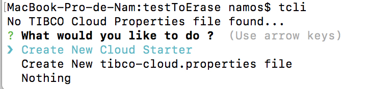

## Getting Started

You will find here a series of tutorials to help you get started and some more advanced subjects.

First of all, we want to get you started and get your environment ready to use TCLI command line

### Installation prerequisites

We are using Nodejs, NPM and Angular CLI, so you will have to install all of theses.


#### Instructions for Mac 

##### 1.) Test if you have NodeJS and NPM installed

To check if you have NodeJS and NPM you can try
```console
node -v
npm -v
```
if get back the latest Version Numbers, you can go to 3.)

##### 2.) Install NodeJS if 1.) failed
Using Homebrew you will get the latest version of NodeJS installed running this command
```console
brew install node
```

Note if you do not have Homebrew and have an error in the above command, install it with the following and re do the command after 
```console
xcode-select --install   
```

##### 3.) Then install Angular CLI 
Be carefully, your angular cli should be installed with -g (for global)


```console
npm install -g @angular/cli
```

Note : Depending on your installation, you might have to add sudo in front of the command if you run in any file access error

##### 4.) Then install GULP
Be carefully, your GULP should be installed with -g (for global)

```console
npm install gulp-cli -g
```
 

#### Instructions for Windows 

##### 1.) Test if you have NodeJS installed

To check if you have NodeJS and NPM you can try
```console
node -v
npm -v
```
if get back the latest Version Numbers, you can go to 3.)

##### 2.) Install NodeJS and NPM if 1.) failed

get latest Windows Installer for Node.js and NPM from [here](https://nodejs.org/en/download/) and follow the Installer Steps.

Alternatives
Using Chocolatey:
```
cinst nodejs.install
```
Using Scoop:
```
scoop install nodejs
```

##### 3.) Then install Angular CLI 
Be carefully, your angular cli should be installed with -g (for global)

```console
npm install -g @angular/cli
```


##### 4.) Then install GULP
Be carefully, your GULP should be installed with -g (for global)

```console
npm install gulp-cli -g
```

#### Reference websites

In case, here are the references websites

[Install NodeJs](https://nodejs.org/en/download/package-manager/)

[Install Angular CLI](https://www.npmjs.com/package/@angular/cli)


### Use TCLI

#### 1.)  Configure private NPM Server

Set the registry to the currently private TIBCO Cloud Starter NPM server, for the @tibco-tsctk scope:

```console
npm config set @tibco-tcstk:registry http://application-lb-npm-1392137160.eu-west-1.elb.amazonaws.com/
```

#### 2.) Install the TCLI command

Install the TCLI command with NPM


```console
npm install -g @tibco-tcstk/cloud-cli
```

#### 3.) Test the command line

Run the command to see if it responds


```console
tcli
```

You should get a response like : 
    
 
 
 You can navigate through all the commands by either : 
 - Using the up and down keys
 - Type the beginning of the command you want to use 
 
 And finally, type the "enter" key to run that command.
 
 alernatively you could try something like 
 
 ```console
 tcli --help
 ```


