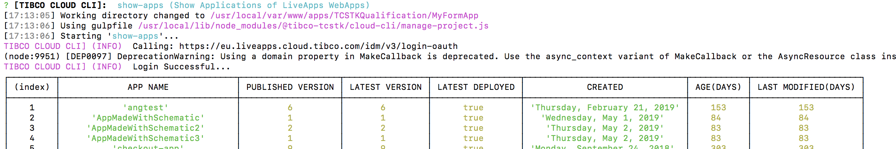
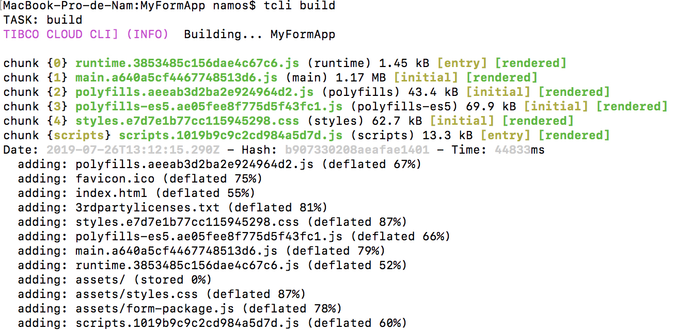

## Feature list

Here is the description of the different "contexts" you can use this command and the  list of features


### Context

Basically there is 2 basic context :

- Empty context : When you run the command in a folder without a tibco-cloud.properties file
- Working context : When you run the command in a folder with tibco-cloud.properties


#### Empty context

When you run the command in a folder without a tibco-cloud.properties file, you will then get the following commands, allowing you to create a working context :

 


##### Create New Cloud Starter

This option will drive you to create a working context with :
- a tibco-cloud.properties (see next section)
- a Cloud Starter Pattern app that you can choose from a list along with its name

You can now go to the newly created folder where all assets have been created for you

Now every time you run the tcli command in that folder, you will be in a [working context](#working-context).


##### Create New tibco-cloud.properties file

Just do a create a tibco-cloud.propertie file which represent a configuration file to connect to Tibco Cloud and some addtionnal informations to be used when working with a Cloud Starter

A series of question will then be asked to you.
- The region you want to connect to (US,EU or AU)
- Your Client ID : [Get Client ID](#get-client-id)
- Your login
- Your password :

    - if you leave that blank, it will be asked every time you run the command
    - if you insert something, it will be obfuscated in the configuration file (becarefull this is a simple obfusction)

Now every time you run the tcli command in that folder, you will be in a [working context](#working-context).

##### Nothing

It just terminates the command


#### Working context

 When you run the command in a folder with tibco-cloud.properties, as you defined a context configuration you will get more advanced command.

You will have access to multiple commands that we could categorize as follow : 
- [Core commands](#core-commands)
- [Cloud Infos](#cloud-infos)
- [Code generation](#code-generation)
- [Code helpers](#code-helpers)
- [Deployment helper](#deployment-helper)


##### Core commands

###### change-region

Change the Region saved in the cloud-properties file


###### obfuscate

Obfuscate a password and save it in the cloud-properties file


###### exit

Terminate the command


###### help

Display's help message on how to use the command 


###### repeat-last-task

Repeats the last executed task


###### create New configuration file

Create a new configuration file


##### Cloud Infos

###### show-cloud

Show Cloud Details for Live Apps

Output is something like 

```json
{ subscriptionId: '111111',
  firstName: 'Guest',
  lastName: 'SEG',
  username: '1111@outlook.com',
  email: '1111@outlook.com',
  sandboxes:
   [ { id: '85', type: 'Developer', groups: [Array] },
     { id: '31', type: 'Production', groups: [Array] } ],
  id: '265' }
```


###### show-apps

Show all webapps/cloud starter UIs deployed in Live Apps Content Management service




##### Code generation


###### Schematic add

This option will help you generate angular components from template.

Once called, you will get a list of template that we do provide, and on selection, you will just have to give a proper name and code will be injected in your component directory.

All inclusion in configuration files will be done for you to use this component @HUGO TODO please confirm this and may be explain the files changed


##### Code helpers

###### inject-lib-sources

Becarefull : this command is for advanced users that can understand the effects of this.

Enables your project for Cloud Library Debugging

When you want to be able to replace the NPM link to our Core and Live Apps library sources directly in your project, so that you can debug and extends our libraries, just run that command.


###### undo-lib-sources

Becarefull : this command is for advanced users that can understand the effects of this.

Undo's the enabling for Cloud Library Debugging.

Basically, you will get back to the NPM link and it removes the sources : understand that you will loose all the modifications that you might have done on that part of the code.


###### start

Start your local cloud starter project so you can browse it on http://localhost:4200


##### Deployment helper

###### build

Build your local cloud starter project and zip it so you will then be able to deploy with the deploy command 




For information the generated Zip will be localted in the dist folder 

###### deploy

Deploy your local cloud starter project to your subscription thanks to the Content Management service from Live Apps


You will get the location to browse your app in the log generated (check the "LOCATION" log)

For example : 
https://eu.liveapps.cloud.tibco.com/webresource/apps/MyFormApp/index.html


###### clean

This will simply clear the temporary folders used by some of the commands


#### Get Client ID

To get this ClientID :
 - Browse and log in Tibco Cloud with either :
 
      [EU subscription](https://eu.account.cloud.tibco.com/manage/home)
      
      [US subscription](https://account.cloud.tibco.com/manage/home)
      
      [AU subscription](https://au.account.cloud.tibco.com/manage/home)
 
 
 - Click on your name at the top right 
 
 
 
 
 - Click on "Settings"
 
 
 
 
 - Click on "Advanced Settings"
 
 
 
 
 - Click on "Display Client ID", then on  "Copy"
 
 


