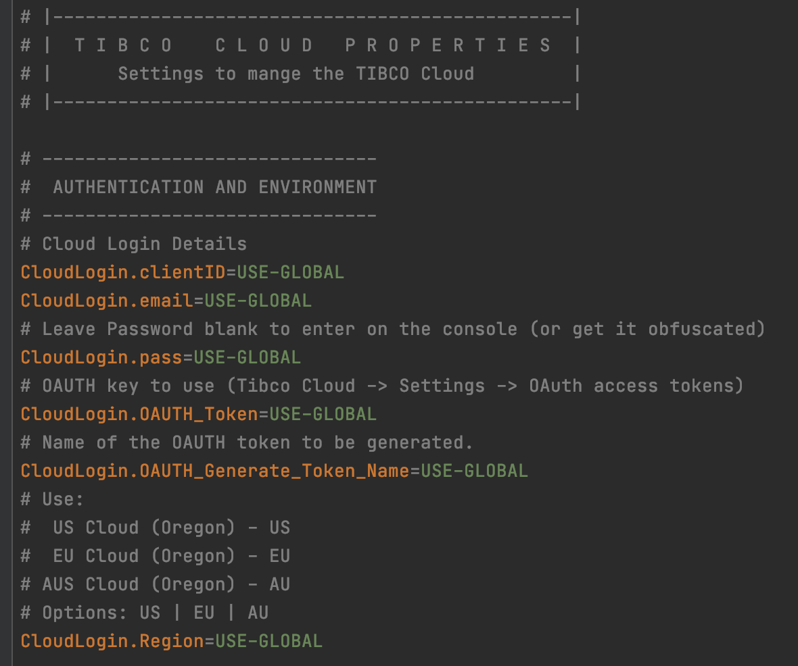
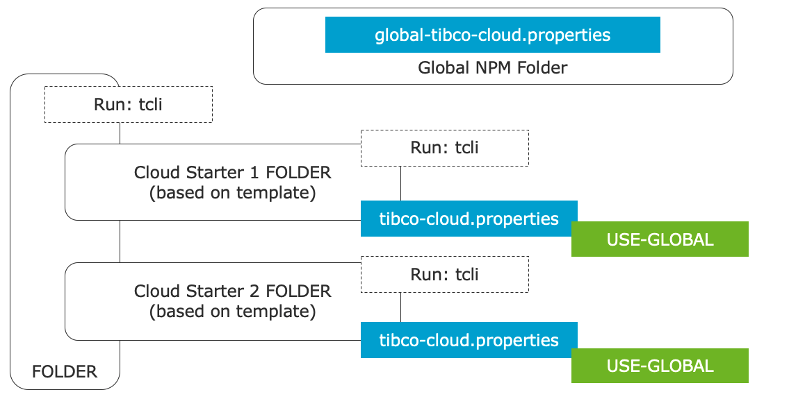

# TCLI: Global Property Configuration
When you run the tcli in a folder without the tibco-cloud property file you have an option to manage the global configuration:


Note you can also manage this global configuration from a folder that has a tibco-cloud property file, with the following two tasks:

```console
tcli view-global-config
tcli update-global-config
```

Or you can get to these tasks in the interactive menu.

The global configuration is a property file that lives within the global NPM folder and can contain values that can apply to various cloud property files on your drive. When a property in a file is specified as ***USE-GLOBAL*** the global file is used:


After you have setup the TIBCO Cloud Connection details in the global file, when you create a new TIBCO Cloud Property file it will initiate with ***USE-GLOBAL*** for the connection details:




This is very useful when you are managing multiple Cloud Starters and you want to share the connection details:



It is also better to use the global configuration from a ***security perspective***, in this way when you accidentally check in the tibco-cloud property file into a source control system (like GitHub) it does not contain any secrets. Although in the cloud starer templates this file is in the .gigignore file.

You can choose to ***store your password*** into the global-tibco-cloud property file. This will be stored in ***obfuscated***(scrambled) way. This is not required but is useful when your OAUTH Token expires; the tcli will then ***fall back*** on this authentication mechanism automatically (otherwise you will be asked for your password again).
