# TCLI: Managing multiple TIBCO Cloud Organizations

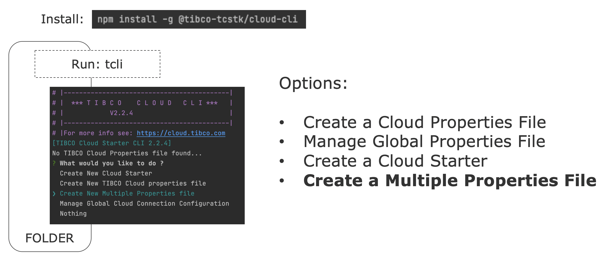

---
## Manage multiple Cloud Starters
When you run the tcli in a folder without the tibco-cloud property file:

```console
tcli 
```
And choose the option to ***Create New Multiple Properties file***

> ***Note:*** When you run tcli in a folder that has a tibco-cloud property file, you can also run (or run the task interactively):

```console
tcli create-multiple-property-file
```

This will ask you for the property name, but you can choose to use the default name, to get:

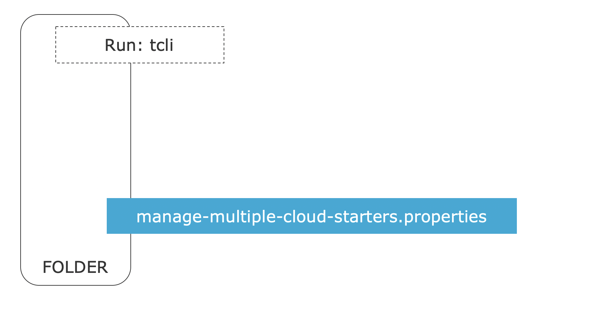

> We will talk about the structure of this manage-multiple Cloud Starter property file in the section [Structure of the Multiple Property file ](#structure-of-the-multiple-property-file) down below.

You don't need to do this, but it's a good practice to create a separate folder to keep your various environment configurations, for example:

```console
mkdir Env
cd Env
```

Now we will run tcli in the Env folder to get a tibco-cloud property file there:

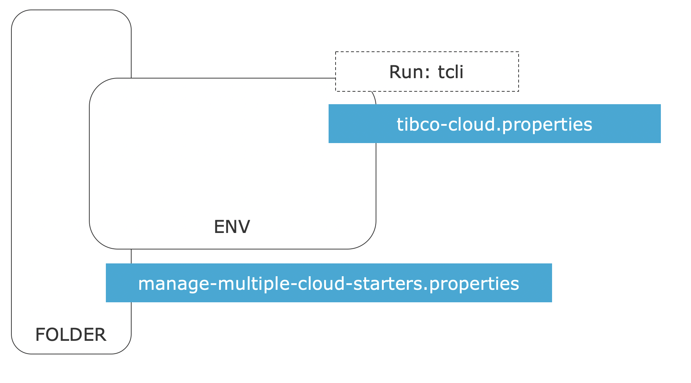

It is recommended that you use a ***global configuration*** for the authentication details (and ***USE-GLOBAL*** is set) so that we get a file that looks like this: 

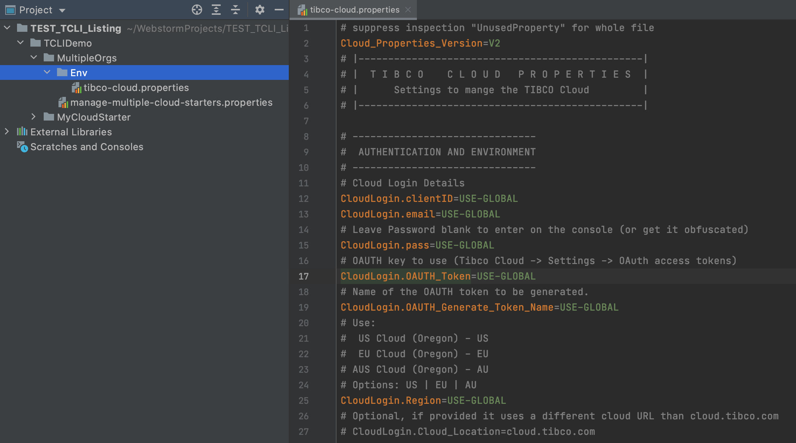

For more information on [Global Configuration click here.](./002_Global_Configuration.md)

In the next step we will create a tibco-cloud property file for every organization that we want to connect to. These files will al use the tibco-cloud property file that we just have created as a base (and tcli will make copies of them). So if we want to make changes to it, it is best to do it now. We will make two changes:

1. We will disable the CloudLogin.OAUTH_Token property
2. We will specify a specific name for the token that we will generate

You can disable a property by using a '#' character in front of it as follows:

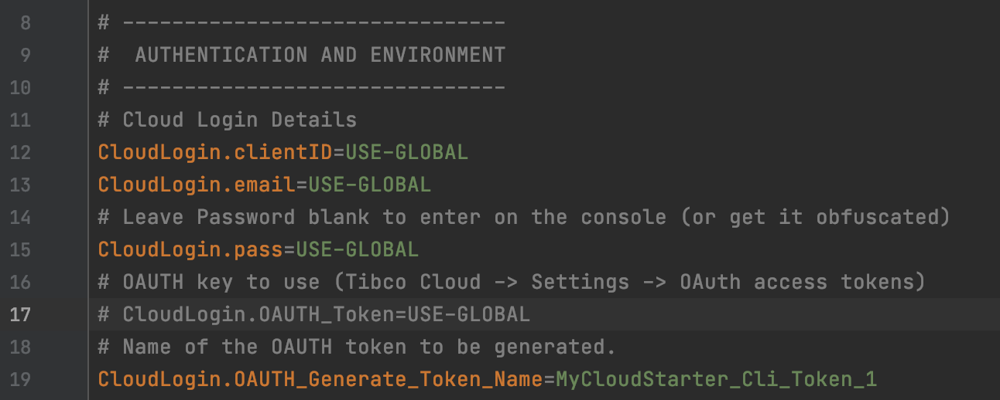

And replace ***USE-GLOBAL*** of ***CloudLogin.OAUTH_Generate_Token_Name*** by a specific value. For example use ***MyCloudStarter_Cli_Token_1*** 

> ***Note:*** It is important to use an underscore and a number at the end of your token name (for example: '_1'). So that your OAUTH Token can be ***Rotated*** by the tcli.

Now we can create the Organization specific cloud property files:

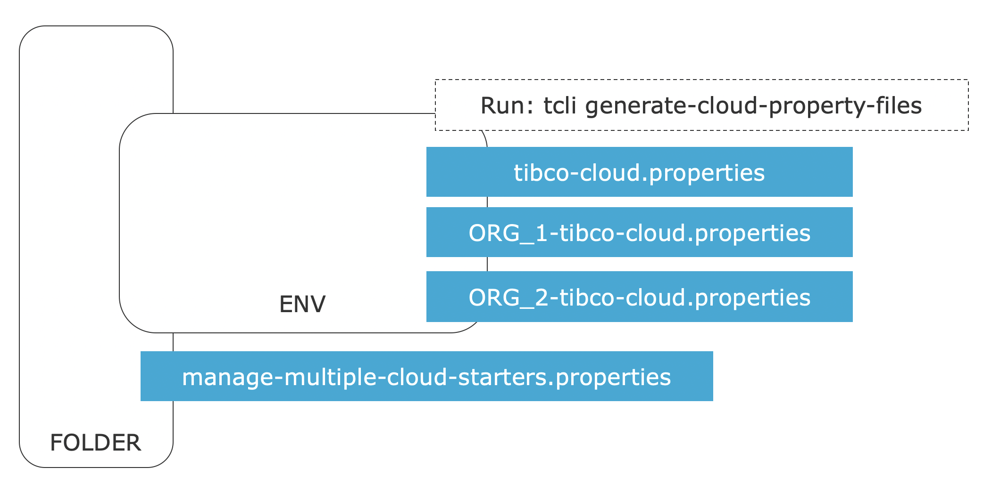

Do this by running tcli (in the Env folder):

```console
tcli 
(and select generate-cloud-property-files)
```

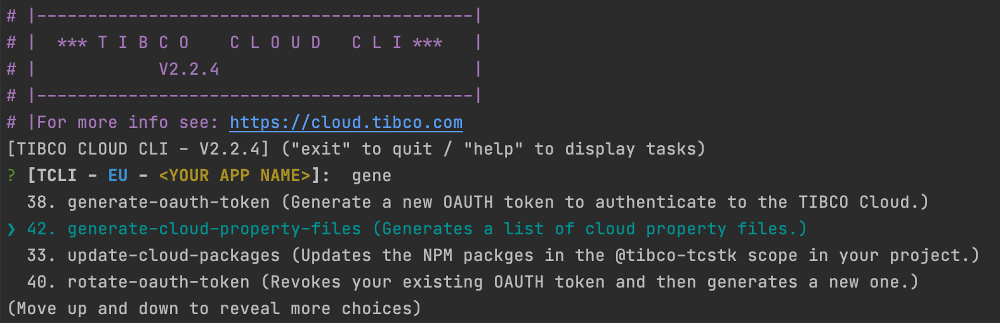

Or run:

```console
tcli generate-cloud-property-files 
```

You will get the question:

```console
What is the name of your Project ?
```

Provide the name of your project (for example ***MyCloudStarter***).
Now you will get a list of organizations that you have access to and for every organization you can create a file for the US, EU and AU regions.

> ***Note***: You can choose to generate all the files, or all in a region or for a specific organization.

After selecting the organizations you will get this question: 

```console
Do you want to add this to your manage-multiple-cloud-starters property file ?
```

Choose Yes to update the manage-multiple Cloud Starter property file to use this file. The next question will ask you for the name of this file:

```console
What is file name of multiple property file ? (press enter for: manage-multiple-cloud-starters.properties)
```

> ***Note:*** If you have created the Env folder this file will live one folder up, in that case provide this as answer:

```console
../manage-multiple-cloud-starters.properties
```

For every organization we now have a file that looks somewhat like this:

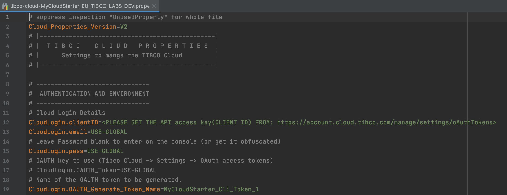

Now replace the ***Client ID*** (in ***CloudLogin.clientID***) with the ID from that specific environment, from here:

https://account.cloud.tibco.com/manage/settings/oAuthTokens

After you have done that for all the environment files, let's go back to our Multiple Property file. 

---
## Structure of the Multiple Property file
The multiple property file contains the information on which organizations to interact with:

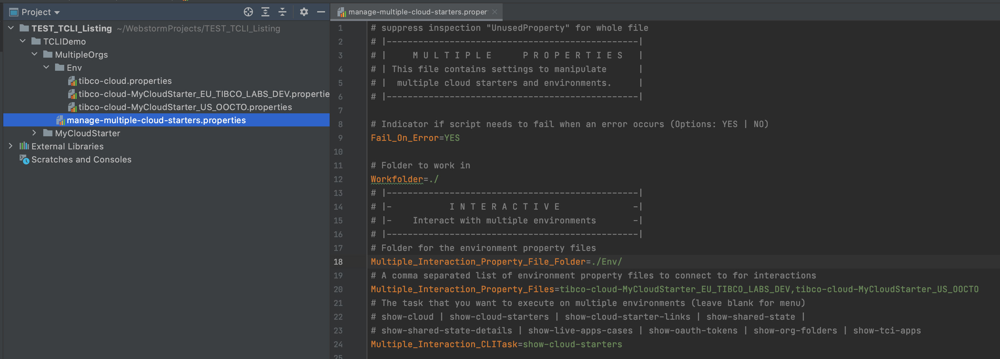

Make sure that the ***Multiple_Interaction_Property_File_Folder*** property is set to the folder where you keep all the organizational property files (for example ./Env/). Notice the slash '/' at the end.

> The ***Multiple_Interaction_Property_Files*** property decides which environments you can interact with. Make sure this points to all the files you want to use from the ./Env/ folder. You don't need to use the .properties extension.

> The ***Multiple_Interaction_CLITask*** contains the ***initial*** task that will be shown. If you leave it blank the interactive tcli menu will come up for an organization. Change this for example to ***show-cloud***.

> Now we can start the interactive menu.

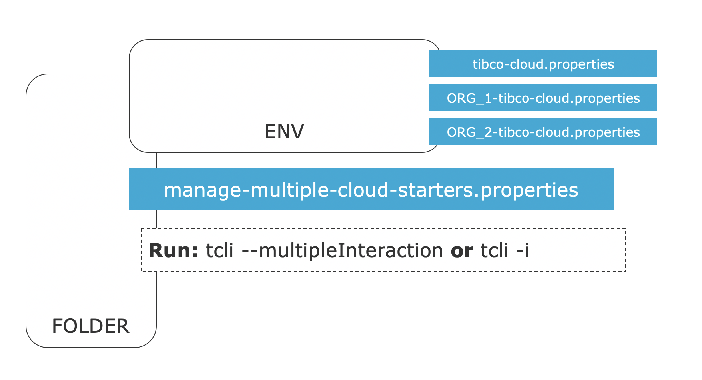

> You can do this by running:

```console
tcli --multipleInteraction
```

Or simply:

```console
tcli -i
```

In the folder where the manage-multiple Cloud Starter property file sits.

> ***Note:*** If you use a different name for the manage-multiple Cloud Starter property file, you can also use:

```console
tcli -i --multipleFile <multiple-file-name>
```

Or simply:

```console
tcli -i -f MyCUTSOM-multiple-cloud-starters.properties
```

This will bring you in an interactive menu that shows your Organizations:

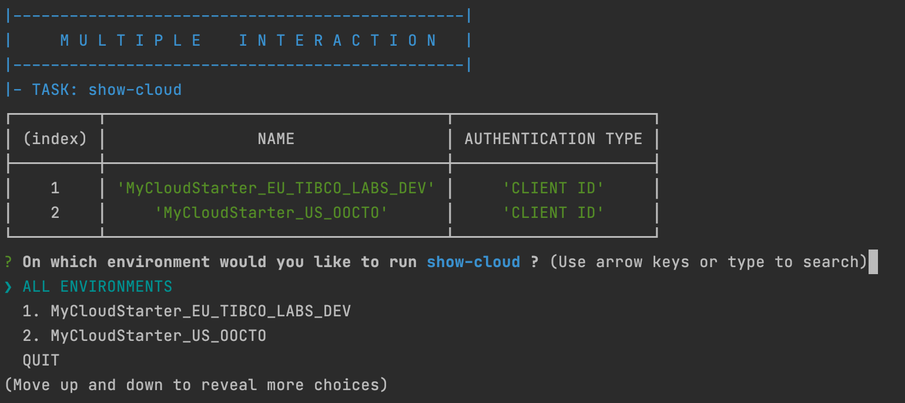

> ***Note:*** In order to check if our configurations are all correct you can run the ***show-cloud*** on all the environments. This should print out the connection details of all the environments (***Check if all the environment names are correct!***).

Since we have setup the OAUTH Token Name in the various Organizational property files we can now generate OAUTH for all the environments, by changing the interactive cli task:

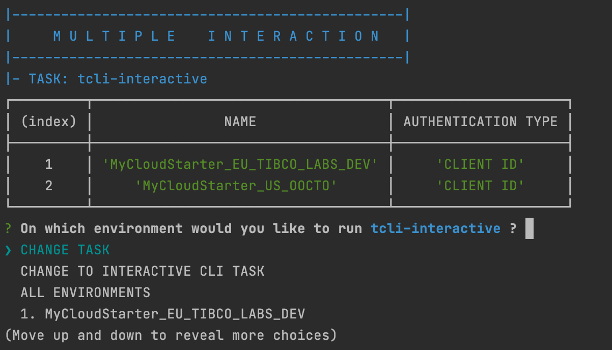

And change the task to ***generate-oauth-token***:

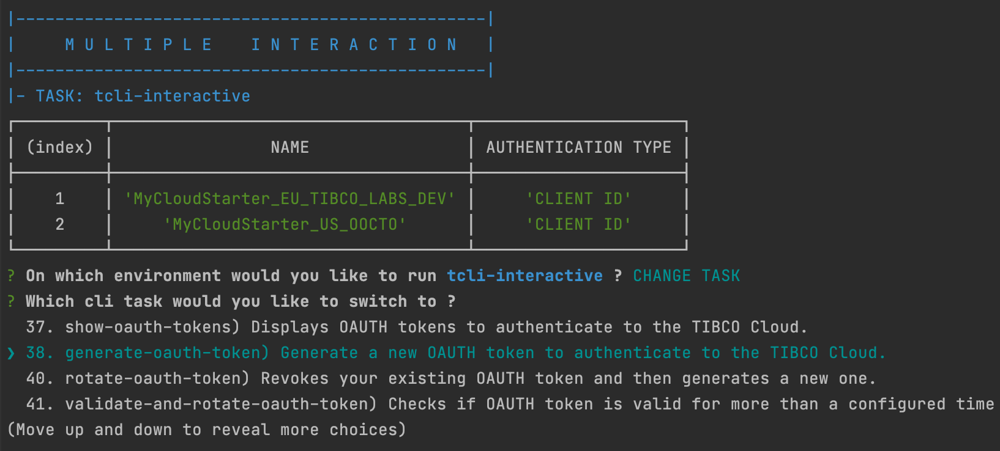

When you run this task on all environments:

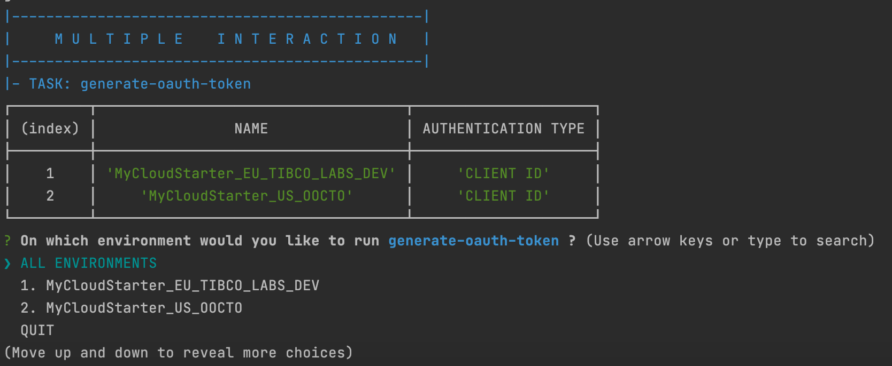

And answer YES to update the property files, you will see the authentication mechanism changing and more information being displayed:

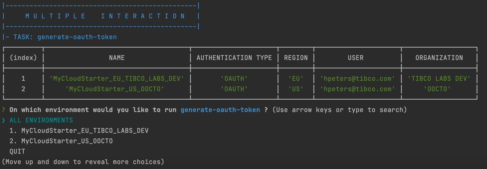

---
## Run tasks on Multiple Organizations
Now you are ready to run any task on any environment and run specific tasks on many environments. For example showing Live Apps and the number of cases. By applying ***show-live-apps-cases***:

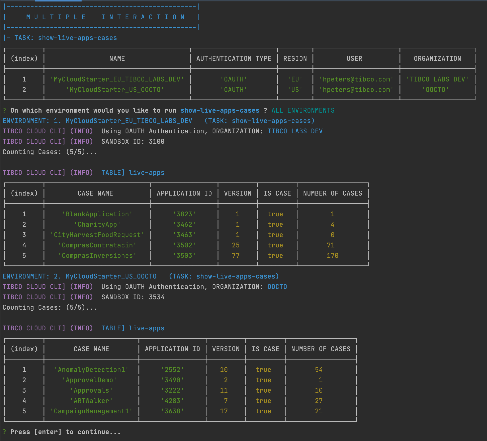

> You can automate this as well in Jobs, which are managed in the remaining part of the multiple cloud starter file. We will discuss this in [Setting up Build Pipelines](./005_Setting_Up_A_Buildpipeline.md)
