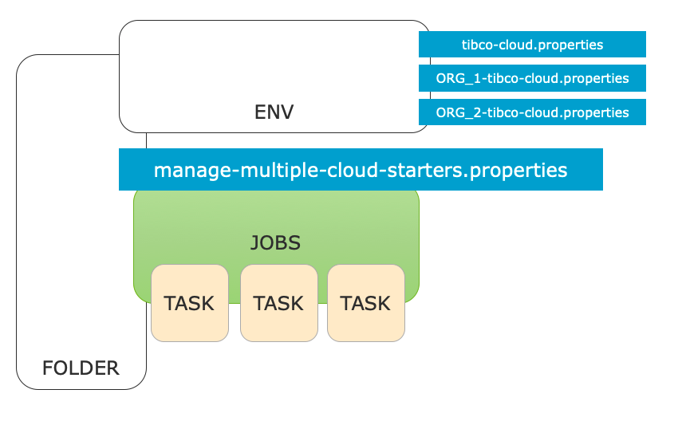
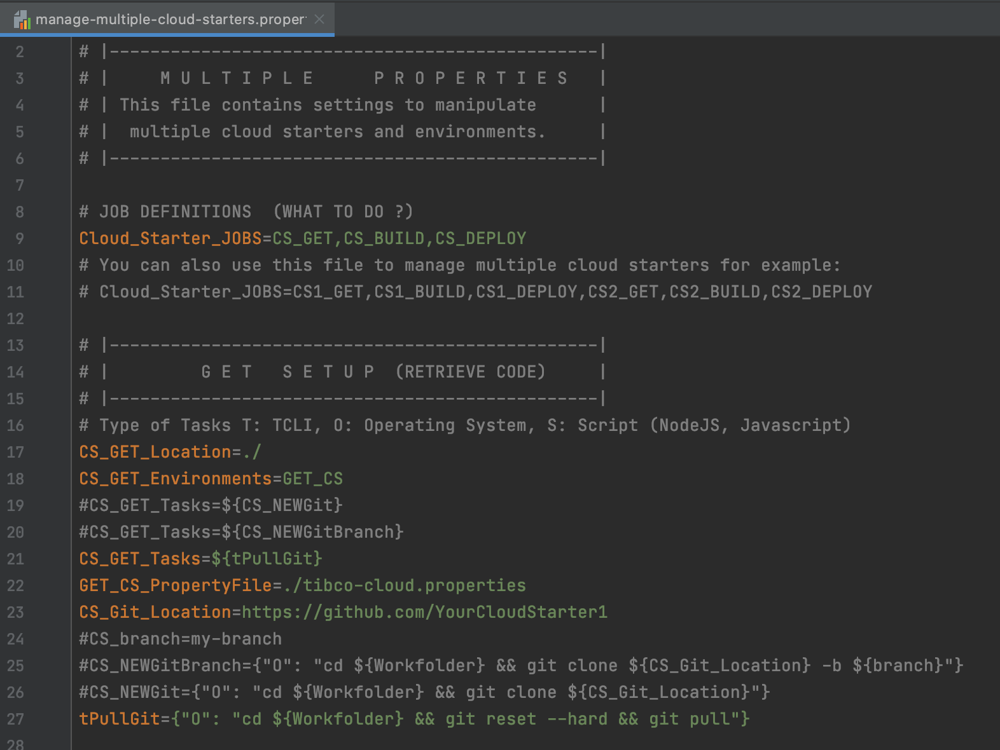
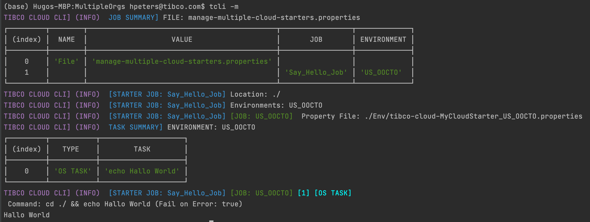
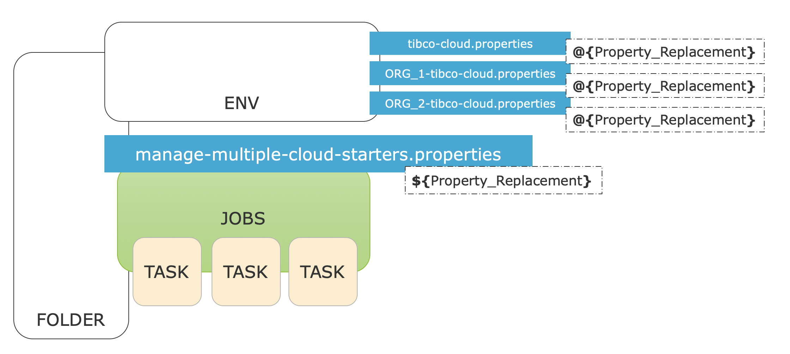
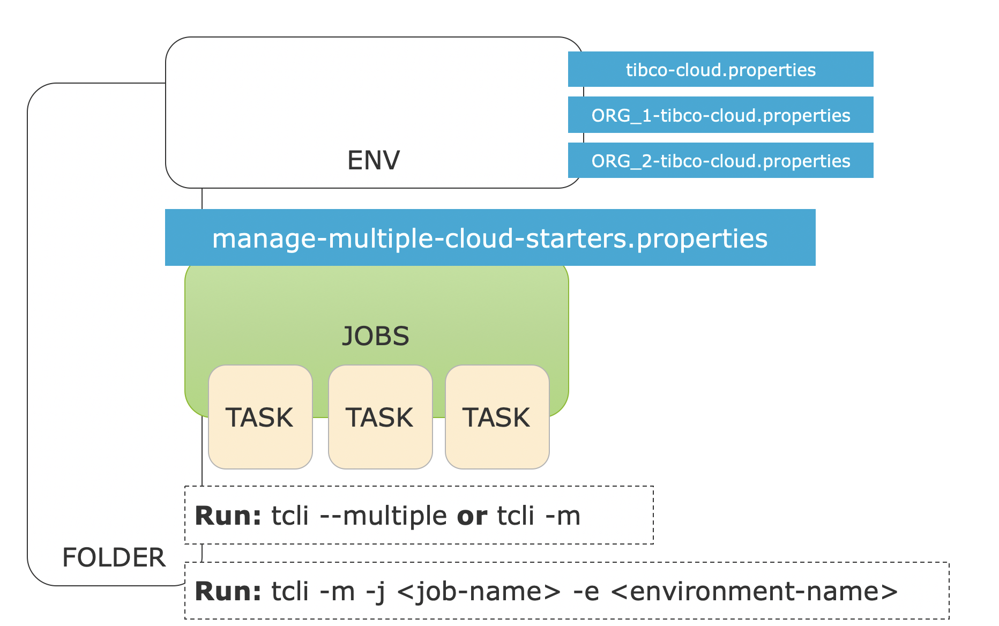

# TCLI: Setting up a Build Pipeline

---
## Multiple Properties file
> In the previous tutorial we have seen how to work with multiple organizations and how to configure the [Multiple Properties file](./004_Multiple_Organizations.md)

In this section we will look at the rest of this file and how to configure it. Basically we can define ***Cloud Starter Jobs*** in the manage multiple Cloud Starter file:

<p align="center">
    
</p>

The initial multiple property file looks like this for example:

<p align="center">
    
</p>

To understand this configuration let's look at the following (simple) example:

```properties
# JOB DEFINITIONS  (WHAT TO DO ?)
Cloud_Starter_JOBS=Say_Hello_Job
# Location: Where to run the Job (locally)
Say_Hello_Job_Location=./
# Environments: Which environments in the TIBCO Cloud to run the Job on
# --> Which cloud Property file to Use
Say_Hello_Job_Environments=US_OOCTO
Say_Hello_Job_Tasks={"O": "echo Hello World"}
# ENVIRONMENTS
US_OOCTO_PropertyFile=./Env/tibco-cloud-MyCloudStarter_US_OOCTO.properties
```

We can run this with the following command:

```console
tcli --multiple
```

or simply:

```console
tcli -m
```

> ***Note:*** If we want to use another file then manage-multiple-cloud-starters.properties we could run:

```console
tcli --multipleFile(-f) <multiple-file-name> 
```

When we run this we get the following result:

<p align="center">
    
</p>

---
## Types of Tasks

The tasks that are run can be of 3 types:

- OS (Operating System Command)
- TCLI Task
- Script Task

An OS Task looks like this:
```.properties
Say_Hello_Job_Tasks={"O": "echo Hello World"}
```

A TCLI Task looks like this:
```.properties
Say_Hello_Job_Tasks={"T": "show-cloud"}
```

A Script Task looks like this:
```.properties
Say_Hello_Job_Tasks={"S": "script.js"}
```

---
## Property Replacements


<p align="center">
    
</p>

---
## Specifying Jobs from the Commandline

<p align="center">
    
</p>


---
## Setting up the Build Pipeline
