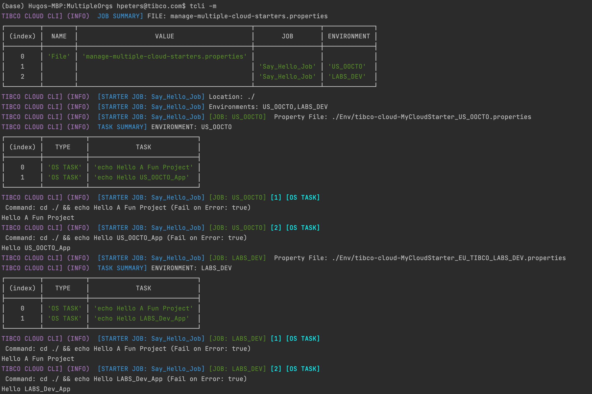

# TCLI: Setting up a Build Pipeline

---
## Multiple Properties file
> In the previous tutorial we have seen how to work with multiple organizations and how to configure the [Multiple Properties file](./004_Multiple_Organizations.md)

In this section we will look at the rest of this file and how to configure it. Basically we can define ***Cloud Starter Jobs*** in the manage multiple Cloud Starter file:

<p align="center">
    
</p>

The initial multiple property file looks like this for example, notice the ***Cloud_Starter_JOBS*** property:

<p align="center">
    
</p>

To understand this configuration let's look at the following (simple) example:

```properties
# JOB DEFINITIONS  (WHAT TO DO ?)
Cloud_Starter_JOBS=Say_Hello_Job
# Location: Where to run the Job (locally)
Say_Hello_Job_Location=./
# Environments: Which environments in the TIBCO Cloud to run the Job on
# --> Which cloud Property file to Use
Say_Hello_Job_Environments=US_OOCTO
Say_Hello_Job_Tasks={"O": "echo Hello World"}
# ENVIRONMENTS
US_OOCTO_PropertyFile=./Env/tibco-cloud-MyCloudStarter_US_OOCTO.properties
```

So a Cloud Starter Job always needs 3 things:

1. A location, defined in the ***[JOB_NAME]_Location*** property. This is the location on the disk where the commands for the tasks will run.
2. One or more environments; defined in the ***[JOB_NAME]_Environments*** property. This points to the tibco-cloud environment property file defined in the ***[ENVIRONMENT]_PropertyFile***.
3. A set of comma separated tasks to run, which can be of various types:

---
## Types of Tasks

The tasks that are run can be of 3 types:

- OS (Operating System Command)
- TCLI Task
- Script Task

An OS Task looks like this:
```properties
Say_Hello_Job_Tasks={"O": "echo Hello World"}
```

A TCLI Task looks like this:
```properties
Say_Hello_Job_Tasks={"T": "show-cloud"}
```

A Script Task looks like this:
```properties
Say_Hello_Job_Tasks={"S": "script.js"}
```

---
## Running the Pipeline Locally

We can run this with the following command:

```console
tcli --multiple
```

or simply:

```console
tcli -m
```

> ***Note:*** If we want to use another file then manage-multiple-cloud-starters.properties we could run:

```console
tcli --multipleFile(-f) <multiple-file-name> 
```

From our little example above we get the following result:

<p align="center">
    
</p>

As you can see first the used property file is printed with a list of Jobs and Environment that they run on. Then every Job is executed sequentially.

---
## Property Replacements

Let's take our example and let's make some changes. First we add a property called ***Project*** at the top. We add our other environment ***LABS_DEV*** at the bottom and then we create two tasks:

```properties
Project=A Fun Project
# JOB DEFINITIONS  (WHAT TO DO ?)
Cloud_Starter_JOBS=Say_Hello_Job
# Location: Where to run the Job (locally)
Say_Hello_Job_Location=./
# Environments: Which environments in the TIBCO Cloud to run the Job on
# --> Which cloud Property file to Use
Say_Hello_Job_Environments=US_OOCTO,LABS_DEV
Say_Hello_Job_Tasks={"O": "echo Hello ${Project}"},{"O": "echo Hello @{App_Name}"}
# ENVIRONMENTS
US_OOCTO_PropertyFile=./Env/tibco-cloud-MyCloudStarter_US_OOCTO.properties
LABS_DEV_PropertyFile=./Env/tibco-cloud-MyCloudStarter_EU_TIBCO_LABS_DEV.properties
```

Note the ***${Project}*** and ***@{App_Name}*** variables in our tasks, these are property replacements and they work as follows:

<p align="center">
    
</p>

So a property encapsulated within ${} is resolved in the multiple cloud starters file and a property encapsulated within @{} is resolved in the individual environment/organization files. So when we run this we get the following. 

<p align="center">
    
</p>

Note that we now run 1 Job with 2 tasks on 2 environments, and that we have different values for the property ***APP_NAME*** in the environment/organization files.

This is an important concept to understand when setting up the build pipelines. Now you can understand the ***${Workfolder}*** and ***${CS_Branch}*** property in the initial example. In this way it is also possible to define Tasks and Subtasks in a readable way for example:

```properties
tImportLiveApps=${tClearTmpFolder},${tCopyFilesForImport},${tMassageImportFiles},${tRunLAImportVerbose}
tClearTmpFolder={"O": "${os_delete} ./tmpImport && mkdir tmpImport"}
tCopyFilesForImport=${tCopyCreator},${tCopyAction}
tCopyCreator={"O": "${os_copy} '@{Case_Folder}/${LA_EXPORT_FOLDER}/CONTENT/Discoveranalysis-ALL.CONTENT.json' ./tmpImport/createCases-Discoveranalysis.json"}
tCopyAction={"O": "${os_copy} '@{Case_Folder}/${LA_EXPORT_FOLDER}/CONTENT/Discoveranalysis-ALL.CONTENT.json' ./tmpImport/actionCases-Discoveranalysis.json"}
tMassageImportFiles={"S": "massageData.js"}
tRunLAImportVerbose={"T":"import-live-apps-cases -a ${LA_Import_Configuration}:Yes"}
```


---
## Specifying Jobs from the Commandline

<p align="center">
    
</p>


---
## Setting up the Build Pipeline
