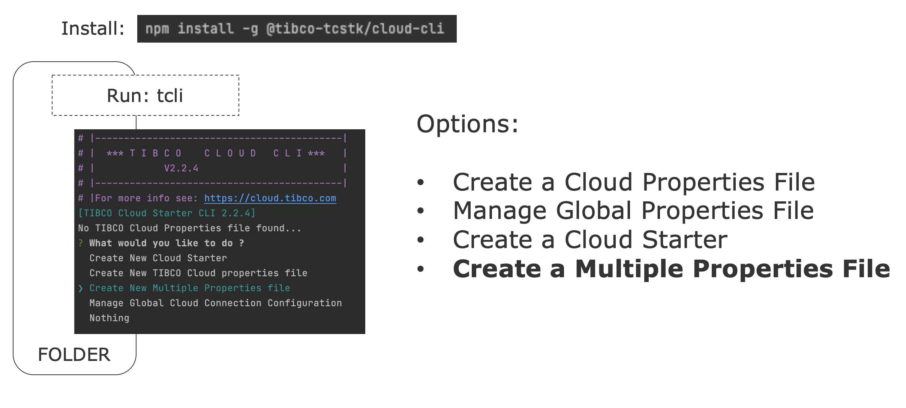

# TCLI: Setting up a Build Pipeline

<p align="center">
    
</p>

---
## Multiple Properties file
> In the previous tutorial we have seen how to work with multiple organizations and how to configure the [Multiple Properties file](./004_Multiple_Organizations.md)

In this section we will look at the rest of this file and how to configure it. Basically we can define ***Cloud Starter Jobs*** in the manage multiple Cloud Starter file:

<p align="center">
    
</p>

The initial multiple property file looks like this for example:

<p align="center">
    
</p>

To understand this configuration let's look at the following (simple) example:

```.properties
# JOB DEFINITIONS  (WHAT TO DO ?)
Cloud_Starter_JOBS=Say_Hello_Job
# Location: Where to run the Job (locally)
Say_Hello_Job_Location=./
# Environments: Which environment in the TIBCO Cloud to run the Job on
# --> Which cloud Property file to Use
Say_Hello_Job_Environments=US_OOCTO
Say_Hello_Job_Tasks={"O": "echo Hallo World"}
# ENVIRONMENTS
US_OOCTO_PropertyFile=./Env/tibco-cloud-MyCloudStarter_US_OOCTO.properties
```


These Jobs consist out of tasks and these tasks can be of 3 types:

- OS (Operating System Command)
- TCLI Task
- Script Task
