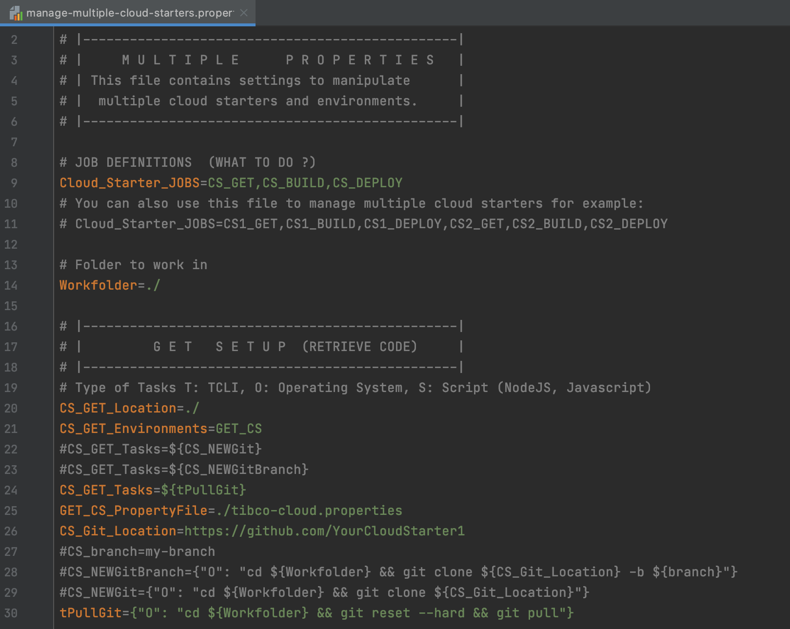
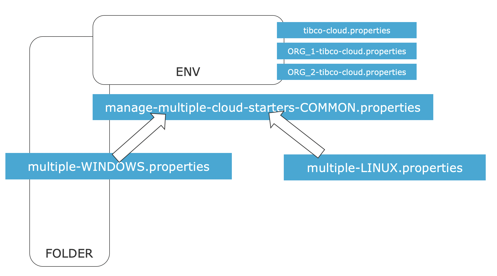
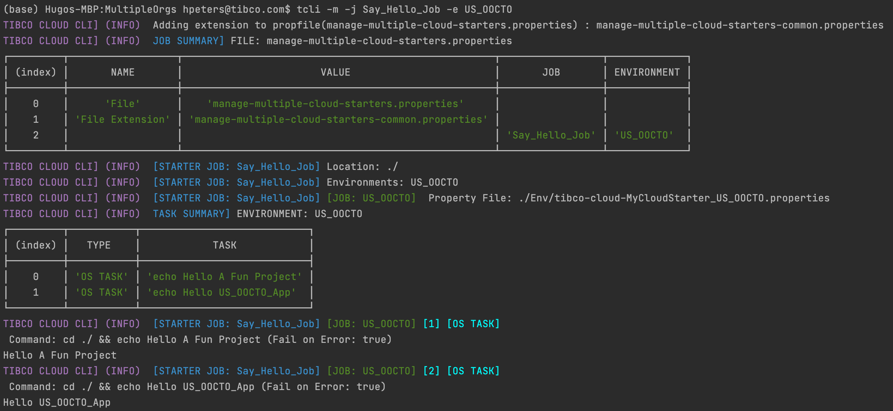
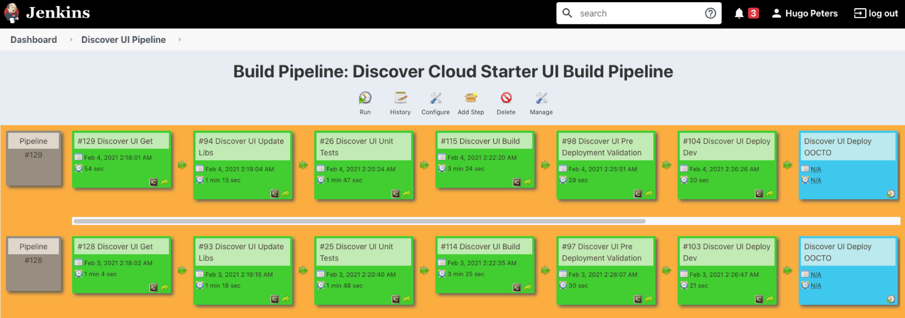
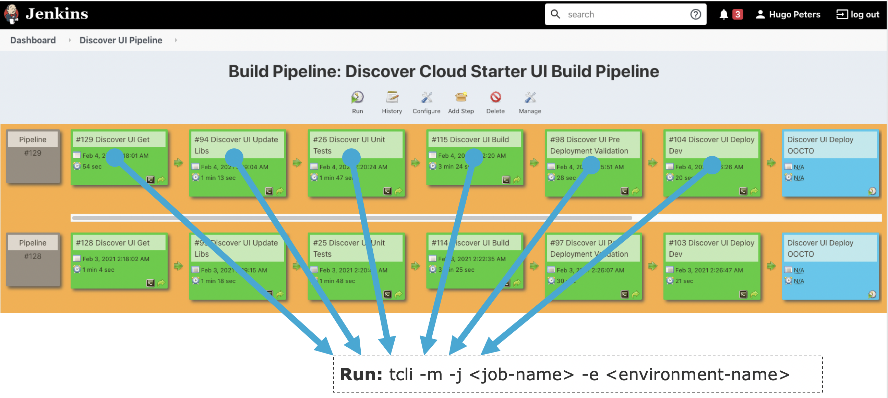
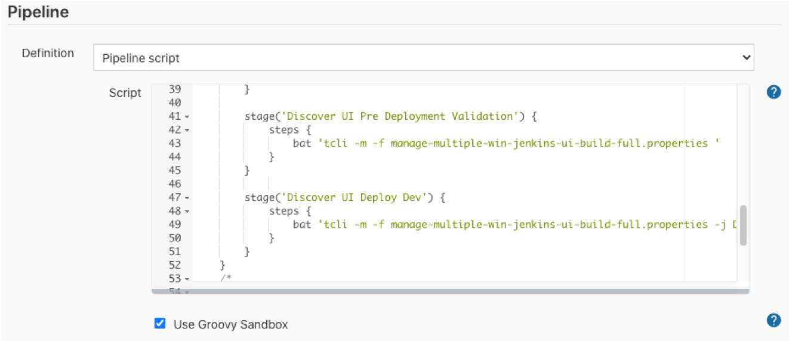
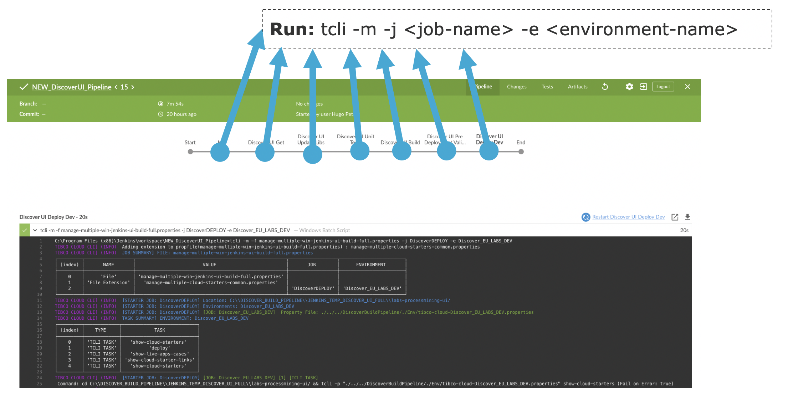
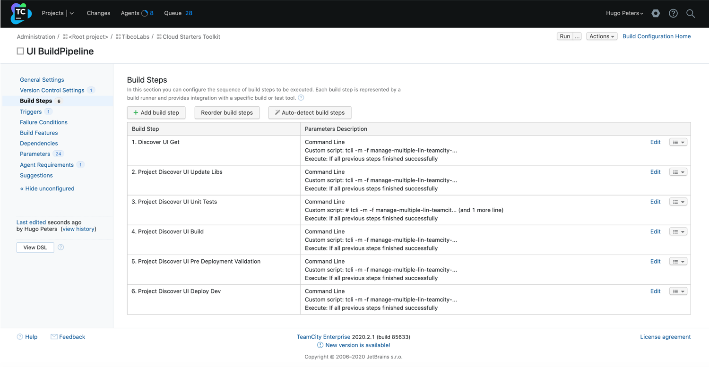
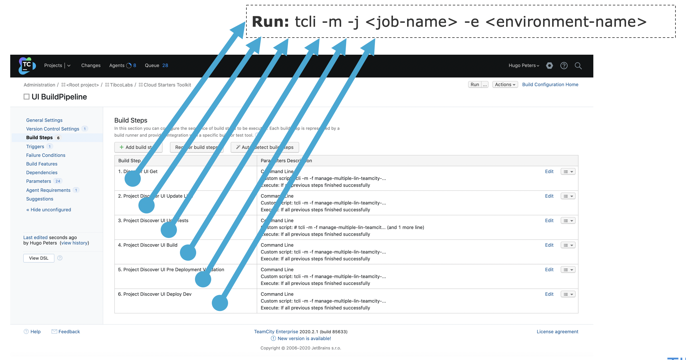
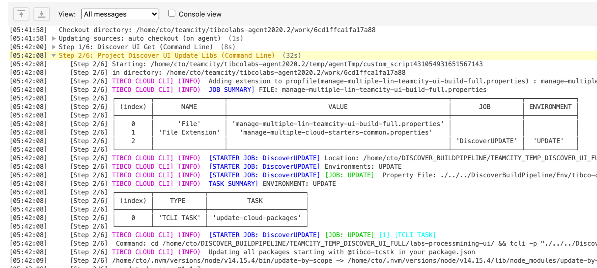

# TCLI: Setting up a Build Pipeline

---
## Multiple Properties file
> In the previous tutorial we have seen how to work with multiple organizations and how to configure the [Multiple Properties file](./004_Multiple_Organizations.md)

In this section we will look at the rest of this file and how to configure it. Basically we can define ***Cloud Starter Jobs*** in the manage multiple Cloud Starter file:


The initial multiple property file looks like this for example, notice the ***Cloud_Starter_JOBS*** property:



To understand this configuration let's look at the following (simple) example:

```properties
# JOB DEFINITIONS  (WHAT TO DO ?)
Cloud_Starter_JOBS=Say_Hello_Job
# Location: Where to run the Job (locally)
Say_Hello_Job_Location=./
# Environments: Which environments in the TIBCO Cloud to run the Job on
# --> Which cloud Property file to Use
Say_Hello_Job_Environments=US_OOCTO
Say_Hello_Job_Tasks={"O": "echo Hello World"}
# ENVIRONMENTS
US_OOCTO_PropertyFile=./Env/tibco-cloud-MyCloudStarter_US_OOCTO.properties
```

So a Cloud Starter Job always needs 3 things:

1. A location, defined in the ***[JOB_NAME]_Location*** property. This is the location on the disk where the commands for the tasks will run.
2. One or more environments; defined in the ***[JOB_NAME]_Environments*** property. This points to the tibco-cloud environment property file defined in the ***[ENVIRONMENT]_PropertyFile***.
3. A set of comma separated tasks to run, which can be of various types:

---
## Types of Tasks

The tasks that are run can be of 3 types:

- OS (Operating System Command)
- TCLI Task
- Script Task

An OS Task looks like this:
```properties
Say_Hello_Job_Tasks={"O": "echo Hello World"}
```

A TCLI Task looks like this:
```properties
Say_Hello_Job_Tasks={"T": "show-cloud"}
```

A Script Task looks like this:
```properties
Say_Hello_Job_Tasks={"S": "script.js"}
```

---
## Running the Pipeline Locally

We can run this with the following command:

```console
tcli --multiple
```

or simply:

```console
tcli -m
```

> ***Note:*** If we want to use another file then manage-multiple-cloud-starters.properties we could run:

```console
tcli --multipleFile(-f) <multiple-file-name> 
```

From our little example above we get the following result:


As you can see first the used property file is printed with a list of Jobs and Environment that they run on. Then every Job is executed sequentially.

---
## Property Replacements

Let's take our example and let's make some changes. First we add a property called ***Project*** at the top. We add our other environment ***LABS_DEV*** at the bottom and then we create two tasks:

```properties
Project=A Fun Project
# JOB DEFINITIONS  (WHAT TO DO ?)
Cloud_Starter_JOBS=Say_Hello_Job
# Location: Where to run the Job (locally)
Say_Hello_Job_Location=./
# Environments: Which environments in the TIBCO Cloud to run the Job on
# --> Which cloud Property file to Use
Say_Hello_Job_Environments=US_OOCTO,LABS_DEV
Say_Hello_Job_Tasks={"O": "echo Hello ${Project}"},{"O": "echo Hello @{App_Name}"}
# ENVIRONMENTS
US_OOCTO_PropertyFile=./Env/tibco-cloud-MyCloudStarter_US_OOCTO.properties
LABS_DEV_PropertyFile=./Env/tibco-cloud-MyCloudStarter_EU_TIBCO_LABS_DEV.properties
```

Note the ***${Project}*** and ***@{App_Name}*** variables in our tasks, these are property replacements and they work as follows:


So a property encapsulated within ${} is resolved in the multiple cloud starters file and a property encapsulated within @{} is resolved in the individual environment/organization files. So when we run this we get the following. 


Note that we now run 1 Job with 2 tasks on 2 environments, and that we have different values for the property ***APP_NAME*** in the environment/organization files.

This is an important concept to understand when setting up the build pipelines. Now you can understand the ***${Workfolder}*** and ***${CS_Branch}*** property in the initial example. In this way it is also possible to define Tasks and Subtasks in a readable way.

Lets now look at a Real World example:

```properties
# Import LiveApps Cases
tImportLiveApps=${tClearTmpFolder},${tCopyFilesForImport},${tMassageImportFiles},${tRunLAImportVerbose}
# First Clear the temporary folders
tClearTmpFolder={"O": "${os_delete} ./tmpImport && mkdir tmpImport"}
# Copy the creator and action files
tCopyFilesForImport=${tCopyCreator},${tCopyAction}
tCopyCreator={"O": "${os_copy} '@{Case_Folder}/${LA_EXPORT_FOLDER}/CONTENT/All.json' ./tmpImport/createCases.json"}
tCopyAction={"O": "${os_copy} '@{Case_Folder}/${LA_EXPORT_FOLDER}/CONTENT/All.json' ./tmpImport/actionCases.json"}
# Run the mapping script
tMassageImportFiles={"S": "massageData.js"}
# Run the import and say yes to the question: Are you sure ?
tRunLAImportVerbose={"T":"import-live-apps-cases -a ${LA_Import_Configuration}:Yes"}
```

This is a piece of a pipeline to import data into LiveApps. There are a few things to uncover here. First of all the top task reuses the tasks below and the ***tCopyFilesForImport*** task is even divided into two more subtasks. Replacements for the ***Case_Folder*** property are made from the ***organizational/environmental property files***(by using @{}). The tasks themselves and a values called ***LA_EXPORT_FOLDER*** and ***LA_Import_Configuration*** are replaced from the multiple property file(by using ${}). The ***import-live-apps-cases*** tcli task is provided answers by the -a character. [Click here for more information on Providing Answers](./006_Passing_In_Answers.md).

We also see an ***os_copy*** task being replaced, and this is ***an interesting one***. TCLI provides the capability to ***extend the property files by*** setting a value called ***PROPERTY_EXTENSION_FILE*** For example:

```properties
PROPERTY_EXTENSION_FILE=manage-multiple-cloud-starters-common.properties
```

This means that the multiple property file can be extended, for example:



Properties in the extension always overwrite properties from the common file, so in this case windows specific property file contains:

```properties
# WINDOWS SPECIFICS
os_delete=rmdir /q/s
```

And the Linux one contains:

```properties
# LINUX SPECIFICS
os_delete=rm -rf
```

This is useful for Operating System specifics but can also be used for other purposes, like creating a multiple cloud build pipeline files specifically for Jenkins or Team City or your own Division. Note that this extending only works once.

---
## Specifying Jobs from the Commandline

Regardless of what you have specified in the Multiple Cloud Starters property file, you can always specify one job and one environment name from the commandline:


For example:

```console
tcli -m -j Say_Hello_Job -e US_OOCTO
```

Which results in:



> ***Note:*** Also look at the fact manage multiple property file is an extension of a common file in the Table at the top.

---
## Setting up the Build Pipeline

Now that we understand and have setup our Jobs and Tasks in the Multiple Cloud Starters property file we can start setting up our build pipeline in a Build Pipeline tool, like for example Jenkins or Team City.

### Jenkins Classic

Jenkins is a tool to manage automatic builds and deployments to manage your CI/CD Pipelines. For more information see <a href="https://www.jenkins.io/" target="_blank">The Jenkins Webpage</a>

Jenkins has a rich eco system of plugins fomr the Jenkins classic view we use a plugin called <a href="https://plugins.jenkins.io/build-pipeline-plugin/" target="_blank">The Build Pipeline Plugin</a>, which gives us a nice view of our pipeline, For Example:



Now in Jenkins every task on the pipeline basically becomes one task in our manage-multiple Cloud Starter property file:



### Jenkins Pipeline Script
A more modern way of working with Jenkins is using <a href="https://www.jenkins.io/doc/book/pipeline/syntax/" target="_blank">Jenkins Pipeline Scripts</a>. In this way you have your actual pipeline stored as code (configuration as code), and you can see the history of your pipeline itself, it looks somewhat like this:



Every step in the script is executed by running the ***tcli cloud starter jobs***:



> ***Note:*** This makes it also very easy to migrate from one build tool to another.

Visually it displays like this:


### Team City

<a href="https://www.jetbrains.com/teamcity/" target="_blank">Team City</a> is very similar to Jenkins and supported by Jetbrains. In Team City you define a Project and then Build Steps:



Like the Jenkins build pipeline you can connect every build step to a run of the ***tcli cloud starter job***:



The output is displayed on the console:



Depending on your setup you can run these build pipelines on demand, when code is checked in or recurring (on a nightly basis for example). 
