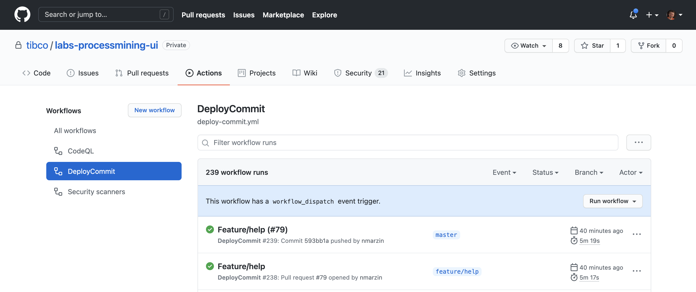
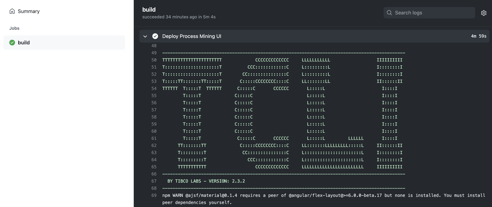

# TCLI: Setting up GitHub Actions with TCLI


---

##Description
In this section we will discuss how you can run tcli tasks automatically after committing some cloud starter code into GitHub. On GitHub you will find this Actions section:



GitHub actions are scripts that run on a container in the cloud or in your own cluster (if configured) to do certain things upon committing of the code.

For more information see the <a href="https://github.com/features/actions" target="_blank">GitHub actions documentation</a>

For example you can run the TCLI in a GitHub Action:



---

##Setting up GitHub Actions

We will set up GitHub actions in the following steps

1. Create a new property file
2. Set up the GitHub action YAML file
3. Set up the Secrets on GitHub
4. Deploy by Committing

### Create a new property file

For this you will need to run the following:

```console
tcli -c -p github-actions.properties
```

Now clean out the connection properties, like this:


> NOTE: You can't use any USE-GLOBAL properties in this file, since they can't be resolved when running the action. 

### Set up the GitHub action YAML file

Now create a .github folder (if it does not exist) and a workflows subfolder, like this:


And paste the following content:

```yaml
# This is a basic workflow to deploy a cloud starter

name: DeployCloudStarter

# Controls when the action will run.
on:
  # Triggers the workflow on push but only for the master branch
  push:
    branches: [ master ]

  # Allows you to run this workflow manually from the Actions tab
  workflow_dispatch:

# A workflow run is made up of one or more jobs that can run sequentially or in parallel
jobs:
  # This workflow contains a single job called "build"
  build:
    # The type of runner that the job will run on
    runs-on: ubuntu-latest

    # Steps represent a sequence of tasks that will be executed as part of the job
    steps:
      # Checks-out your repository under $GITHUB_WORKSPACE, so your job can access it
      - uses: actions/checkout@v2

      # Runs a set of commands using the runners shell
      - name: Deploy Cloud Starter
        env:
          TCLI_EMAIL: ${{ secrets.TCLI_EMAIL }}
          TCLI_CLIENTID: ${{ secrets.TCLI_CLIENTID }}
          TCLI_PASS: ${{ secrets.TCLI_PASS }}
        run: |
          echo DEPLOYING Cloud Starter...
          npm install
          npm install --save-dev @tibco-tcstk/cloud-cli
          npx tcli -v
          npx tcli -p github-actions.properties show-properties
          npx tcli -p github-actions.properties add-or-update-property -a DEFAULT:CloudLogin.email:none:$TCLI_EMAIL
          npx tcli -p github-actions.properties add-or-update-property -a DEFAULT:CloudLogin.clientID:none:$TCLI_CLIENTID
          npx tcli -p github-actions.properties add-or-update-property -a DEFAULT:CloudLogin.pass:none:$TCLI_PASS
          npx tcli -p github-actions.properties show-properties
          npx tcli -p github-actions.properties show-cloud
          npx tcli -p github-actions.properties build-deploy-cloud-starter
```

And commit this to GitHub.

The import part is this:


This part basically describes to update the connection settings in the property file and then run a build & deploy command. The connection settings are stored as secrets which we will set in GitHub in the next section.

###Set up the Secrets on GitHub

You can set up the secrets in the secrets area under settings:


It is important to realize that you can only enter the secrets, you cannot retrieve them. Setup the following secrets, to connect to the TIBCO Cloud:

* TCLI_EMAIL
* TCLI_CLIENTID 
* TCLI_PASS


###Deploy by Committing

Now when you do a commit, you will see your cloud starter getting build and deployed through the action:


