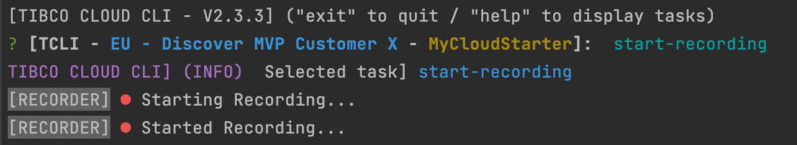

# TCLI: Recording Scripts



With the tcli you can interactively work with the TIBCO Cloud, all these interactions can be recorded. In this way you can create a script to replay this later.

---
## Configure Recording
In this section we will discuss how you can configure this recording. You will find a RECORDER section in your cloud property file:

```properties
# ------------------------
#  RECORDER
# ------------------------
# The recorder allows you to store executed tcli commands into an (executable) file, so you can replay these commands.
# Do you want to use the recorder; this enables the display or replay commands.
#  Note: this does not mean that you are recoding directly (YES | NO)
Recorder_Use=YES
# Setting to record from loading (YES | NO)
# Note: you can also start and stop recording with the start-recording and stop-recording command.
Recorder_Do_Record_From_Start=NO
# File that you want your recordings to go to
Recorder_File_To_Record_To=./tcli-recordings.sh
```

When the recorder is used you can start tcli and every time after you run a task the recorder will print out what the task did for example:


Note you can also get this information with the *--showReplay* flag, for example:

```console
tcli list-spotfire-library --showReplay
```

To start the recording immediately use YES for this flag: 

> Recorder_Do_Record_From_Start
 
The file the recording will go to is set by this property: 

> Recorder_File_To_Record_To

## Record in the interactive mode

When you startup the tcli interactively:

```console
tcli 
```

### Start Recording

You can trigger the task to Start Recording:


The recorder will now be started: 


Every command that you will run is now stored: 


And will be saved in the configured file:


> NOTE: The given anwsers are also recorded, and if you use a different property file than tibco-cloud.properties this is also stored.

### Record from the Commandline

You can also create a recording directly from command line by using:

```console
tcli --record <recording-file>
```

or:

```console
tcli -r <recording-file>
```

So for example:

```console
tcli show-cloud -r tcli-recordings.sh 
```

### Stop Recording

You can stop the recording by closing the interaction (quit), or run the stop-recording command:


And your recording will be stopped:


## Replay your recording

To replay your recording simply run your script file.

> NOTE: On linux based systems you will have to change the execution permissions on the file by running:

```console
chmod +x tcli-recordings.sh
```

And then you can run:

```console
./tcli-recordings.sh
```

> NOTE: On windows record to a .bat file and run that file.

## Use replacements for scripting

After you made your recording usually you want to make your script more generic, this can be done by property replacements.

You can use ~{} Replacements for Globals, so for example ~{Organization}, which will translate to the organization name.

You can use @{} replacements for properties in your property file, so for example lets say we have this property in our cloud property file:


You can now rewrite the script to:


In this way you can build script that are generic to deploy your cloud starters to various environments with various different settings.
