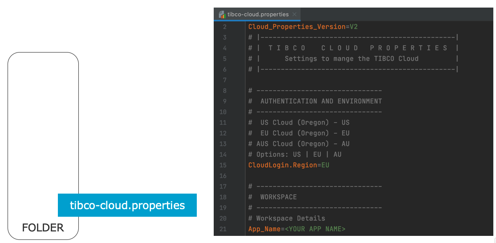

# TCLI: Overview

<p align="center">
    
</p>

---

## Description

> The **TIBCO Command Line Interface (TCLI)** is a tool that can be run from the command line to **manage** your **Cloud Starters** and interact with the **TIBCO Cloud**. The tool can be used on Windows, Linux or a MAC. By entering commands on a terminal you work **interactively** (Questions & Answers) or **directly** by providing the answers inline or from a (property) file. It serves the following use cases:

* Manage your developer environment of a Cloud Starter.
* Interact and Manage your Cloud Starter on the TIBCO Cloud.
* Support certain operations in your TIBCO Cloud Organization.
* Execute repeatable deployment, management, monitoring and testing tasks.
* Integrate with a Continuous Integration Build pipeline

---

## Prerequisites

> The TCLI works based on <a href="https://nodejs.org/en/download/" target="_blank">Node.js</a>, which can be downloaded from <a href="https://nodejs.org/en/download/" target="_blank">here</a>.
> You can check your node installation by running one of the following commands:

```console
node -v
npm -v
```

> Since a Cloud Starter is an <a href="https://angular.io/" target="_blank">Angular Application</a>, you will need the <a href="https://cli.angular.io/" target="_blank">Angular CLI.</a> After you have installed Node.js, you can install the Angular CLI with the following command:

```console
npm install -g @angular/cli
```

---

## Installation

> Use the following command to install the TCLI:

```console
npm install -g @tibco-tcstk/cloud-cli
```

> You can validate your installation by running:

```console
tcli -v
```

> This should print the version of the TCLI that you are using.

---

## Help

> When running the TCLI you can always request help by running the following command:

```console
tcli help
```

> Or get help on a specific task, by running:

```console
tcli help <TASK-NAME>
```

> This can also be shorted with -h, for example:

```console
tcli -h show-cloud
```

---

## Getting Started

> The best is to create a new empty folder on your machine and go there with a terminal. But you can run from any folder if you like. When you start the TCLI by just running:

```console
tcli 
```

> Without any additional options the command line tool will look for a file called 'tibco-cloud.properties'. If this file is not found you get 4 options:

<p align="center">
    
</p>

> To get started just choose to create a new property file. The tcli will ask you for your Client ID and login details to the TIBCO Cloud to create an OAUTH Token. Get your client ID from https://cloud.tibco.com/ -> Settings -> Advanced Settings -> Display Client ID. If you have a global configuration already setup the tcli will use that configuration for the connection details. Read more about Global Configuration here: [Global Configuration](./002_Global_Configuration.md)

> Note: you can also run to use or create a tibco cloud property file with a different name:

```console
tcli -p <PROPERTY-FILE-NAME>
```

> A property file is generated, which contains information for the tcli to do it's work:

<p align="center">
    
</p>


> After the property file is generated you will get into an interactive menu with a list of tasks:

<p align="center">
    
</p>


> All subsequent times you run tcli in this folder you will get into this menu. From here you can choose any of the tasks to run. You can ***start typing*** in this menu to ***search within the available tasks*** and their descriptions. But you can also use the ***up and down arrows*** to scroll through them. Press enter to run a task, for example the first one show-cloud. Running this task also validates that the tcli can actually connect with the TIBCO Cloud and shows the connected organization. The results looks somewhat like this:

<p align="center">
    
</p>


> Note: After running a task you can always press up and run **repeat-last-task** to re-run the task you just run. This is very handy, to quickly repeat a task.

> You can also run a task directly without getting into the interactive menu, by running:

```console
tcli <TASK-NAME>
```

> For example:

```console
tcli show-cloud-starter-links
```

<p align="center">
    
</p>


> Certain tasks also have an ***alternative short name***, for example

```console
tcli sl
```

> You can find these Alternatives in the help description of a task:

```console
tcli -h show-cloud-starter-links
```

> Now you are ready to [setup your own Cloud Starter](./003_Get_Started_With_Cloud_Starters.md)

