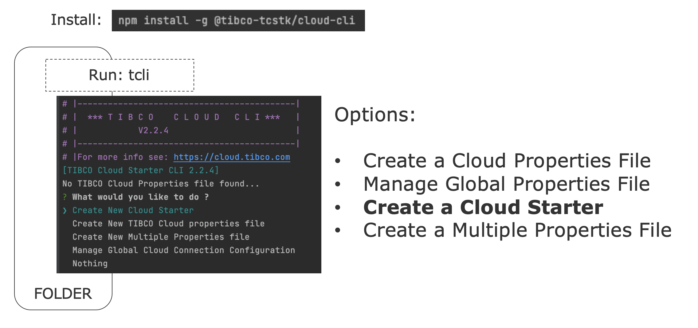
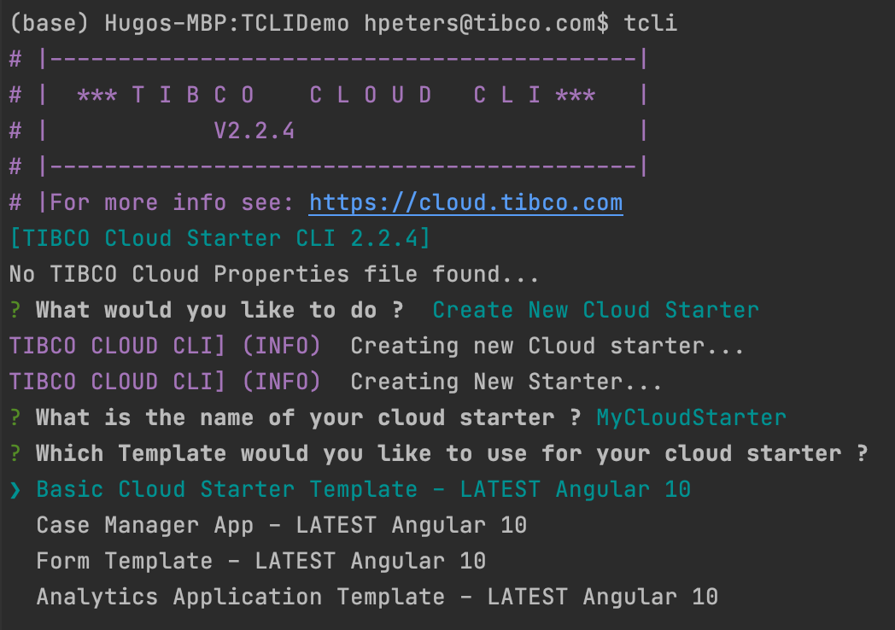

# TCLI: Get started with Cloud Starters



---
## Set up your own Cloud Starter
> When you run the tcli in a folder without the tibco-cloud property file:
```console
tcli 
```
> or
```console
tcli new
```

> You have an option to ***Create a New Cloud Starter***. You will get into an interactive menu where you answer the following questions:

```console
What is the name of your cloud starter ?
```

```console
Which Template would you like to use for your cloud starter ?
```

> For example: 



> The tcli will fetch the Cloud Starter based on the template that you choose (from Git). The tcli will create the following folder structure:


---
## Start the Cloud Starter locally
> When 

---
## Make a change to the Cloud Starter
> When 

---
## Apply a Schematic
> When 


---
## Deploy the Cloud Starter to the Cloud
> When 

